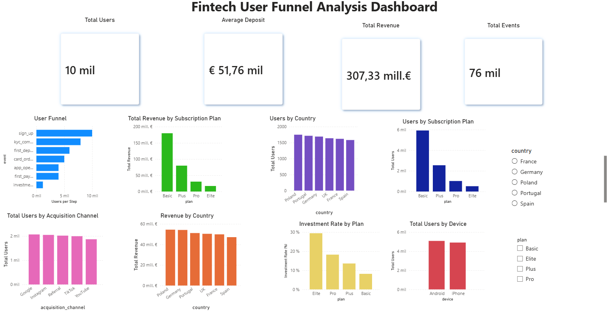

# Fintech User Funnel Analysis

An end-to-end data analytics project that simulates user behavior in a fintech application.

The project covers the complete analytics workflow, from synthetic data generation to interactive business dashboards.

---

# Dashboard Preview



---

# Project Overview

The objective of this project is to analyze the complete onboarding journey of users in a fintech platform.

Users progress through several onboarding stages, generating events that allow us to answer business questions such as:

- Where do users drop off during onboarding?
- Which subscription plan generates the most revenue?
- Which countries have the highest engagement?
- Which acquisition channels attract the most users?
- Which plans have the highest investment adoption?
- What devices are users using?

The entire dataset is synthetically generated using Python to simulate a realistic fintech environment.

---

# Dataset

The project is based on two datasets.

## users

Each row represents one registered user.

| Column | Description |
|---------|-------------|
| user_id | Unique user identifier |
| age | User age |
| country | Country |
| device | Android / iPhone |
| acquisition_channel | Marketing acquisition source |
| registration_date | Registration date |
| income_level | Estimated monthly income |
| occupation | User occupation |
| plan | Subscription plan |

Approximately:

- **10,000 users**

---

## events

Each row represents one event generated by a user.

| Column | Description |
|---------|-------------|
| user_id | User identifier |
| event | Event name |
| timestamp | Event timestamp |
| deposit_amount | Deposit amount (only for deposit events) |

Possible events:

- sign_up
- kyc_completed
- first_deposit
- card_ordered
- app_opened
- first_payment
- investment_started

Approximately:

- **75,000+ events**

---

# Project Structure

```
FINTECH-USER-FUNNEL-ANALYSIS

├── dashboard
│   ├── fintech_user_funnel_dashboard.pbix
│   └── dashboard_preview.png
│
├── data
│   ├── users.csv
│   ├── events.csv
│   └── fintech.db
│
├── docs
│   └── data_model.md
|   
│
├── sql
│   ├── funnel_analysis.sql
│   ├── revenue_analysis.sql
│   ├── segmentation_analysis.sql
│   ├── device_analysis.sql
│   ├── country_analysis.sql
│   └── plan_analysis.sql
│
├── src
│   ├── generate_data.py
│   ├── create_database.py
│   ├── funnel_analysis.py
│   ├── activity_analysis.py
│   ├── retention_analysis.py
│   ├── business_insights.py
│   └── time_analysis.py
│
├── requirements.txt
├── README.md
└── .gitignore
```

---

# Technologies Used

- Python
- Pandas
- SQLite
- SQL
- Power BI
- Git
- GitHub

---

# Data Generation

The dataset is completely generated using Python.

The generator creates:

- Realistic user profiles
- Different subscription plans
- Multiple European countries
- User events following the onboarding journey
- Random timestamps
- Deposit amounts
- Marketing acquisition channels
- Mobile devices

This allows the project to simulate realistic business scenarios while avoiding the use of confidential data.

---

# SQL Analysis

Several SQL scripts were created to answer different business questions.

### Funnel Analysis

- User progression through onboarding

### Revenue Analysis

- Revenue by subscription plan
- Revenue by country

### User Segmentation

- User distribution by country
- User distribution by plan

### Device Analysis

- Android vs iPhone

### Country Analysis

- Country comparison

### Plan Analysis

- Subscription plan comparison

---

# Power BI Dashboard

The interactive dashboard includes:

## KPIs

- Total Users
- Average Deposit
- Total Revenue
- Total Events

## Funnel Analysis

- Users per onboarding step

## Revenue Analysis

- Revenue by subscription plan
- Revenue by country

## User Analysis

- Users by country
- Users by subscription plan
- Users by acquisition channel
- Users by device

## Investment Analysis

- Investment rate by subscription plan

## Interactive Filters

- Country
- Subscription Plan

---

# Business Insights

The dashboard allows answering questions such as:

- Which subscription plan generates the highest revenue?
- Which countries contribute the most revenue?
- Which acquisition channel attracts more users?
- Where do users leave the onboarding funnel?
- Which users are more likely to start investing?
- Which mobile platform is more common?

---

# How to Run

## Clone the repository

```bash
git clone https://github.com/daniel-deblas/fintech-user-funnel-analysis
```

---

## Install dependencies

```bash
pip install -r requirements.txt
```

---

## Generate the dataset

```bash
python src/generate_data.py
```

---

## Create the SQLite database

```bash
python src/create_database.py
```

---

## Run the Python analysis

```bash
python src/business_insights.py
```

---

## Open the dashboard

Open the Power BI file located at:

```
dashboard/fintech_user_funnel_dashboard.pbix
```

using Microsoft Power BI Desktop.

---

# Key Metrics

Current simulated dataset:

- 10,000 users
- 75,000+ events
- €307M simulated revenue
- Four subscription plans
- Six European countries
- Multiple acquisition channels
- Android and iPhone users

---


# Author

**Daniel Deblas**

Computer Engineering Student  
Universidad Carlos III de Madrid

